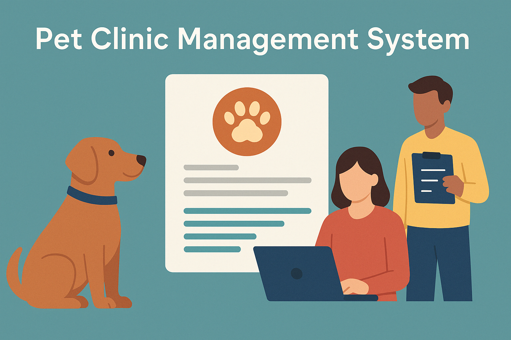

# Sistema de Gerenciamento de Pets



Esse projeto é um sistema simples para clínicas veterinárias. Ele ajuda a organizar os dados dos clientes e dos pets.

---

## Sobre

Esse sistema foi feito com Laravel. A ideia foi criar algo direto e útil para clínicas que precisam controlar os atendimentos e registros dos animais.

---

## O que o sistema faz

- Cadastro de clientes (nome, telefone, e-mail, etc)
- Cadastro de animais (nome, idade, espécie, raça, etc)
- Registro de consultas (data, observações e descrição)
- Ligar os pets com os donos
- Mostrar o histórico de atendimentos

---

## Instalação

Para rodar, você precisa ter:

- PHP 8.4+
- Docker
- Composer
- Laravel Sail

**Passo a passo:**

1. Clonar o repositório

```
git clone https://github.com/kinberlysantos/app_2a.git
cd app_2a
```

2. Subir o projeto

```
./vendor/bin/sail up -d
```

3. Configurar o `.env` com os dados do banco

```
DB_CONNECTION=mysql  
DB_HOST=127.0.0.1  
DB_PORT=3306  
DB_DATABASE=clinica_pets  
DB_USERNAME=root  
DB_PASSWORD=
```

4. Rodar as migrations

```
./vendor/bin/sail artisan migrate
```

5. (opcional) Preencher com dados de exemplo

```
./vendor/bin/sail artisan db:seed
```

6. Acessar no navegador:

```
http://localhost
```

---

## Agradecimentos

Esse projeto foi feito com base em exemplos de sistemas reais de clínicas. Agradeço a quem contribuiu com ideias e a comunidade Laravel pelas ferramentas.

---

## Contato

Se quiser mandar alguma ideia ou sugestão:

- Coordenação: Kinberly Lopes dos Santos
- Back-End: Sara Ribeiro da Silva 
- Front-End: Maria Eduarda Anjos da Silva